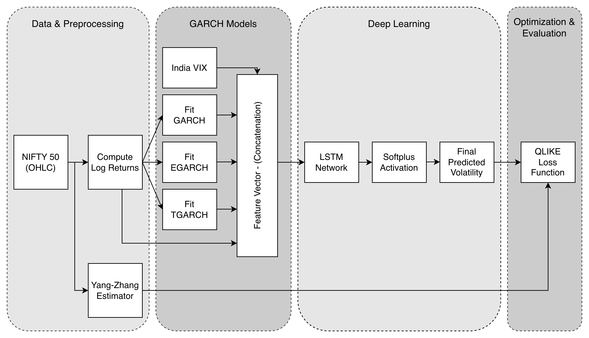
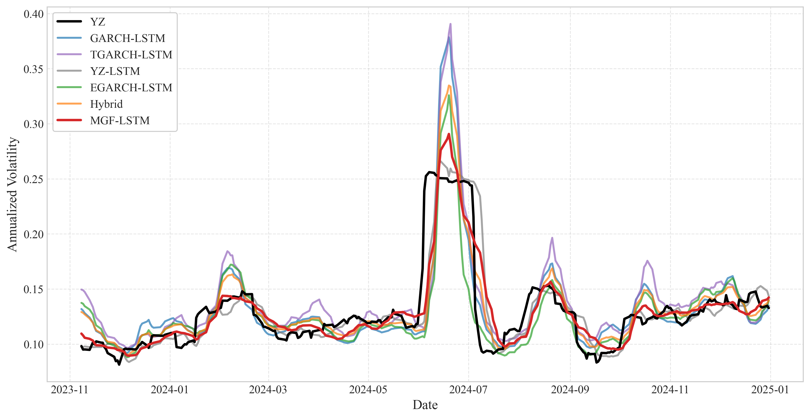
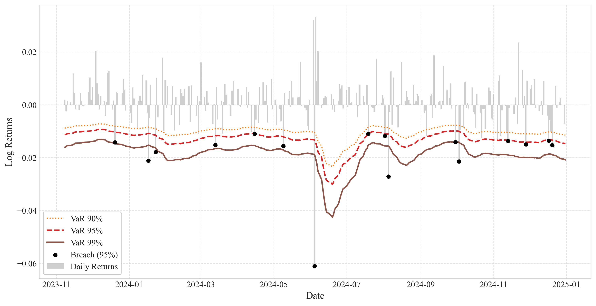
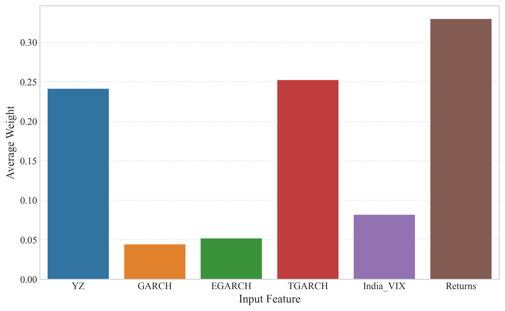

# MGF-LSTM: Multi-GARCH Fusion LSTM

Predicting financial market volatility through adaptive hybrid modeling combining statistical rigor with deep learning intelligence.

---

## Table of Contents

1. [Overview](#overview)
2. [Installation & Setup](#installation--setup)
3. [Usage](#usage)
4. [Project Architecture](#project-architecture)
5. [Pipeline Overview](#pipeline-overview)
6. [Performance Summary](#performance-summary)
7. [Technologies Used](#technologies-used)
8. [Baseline Models](#baseline-models)
9. [License](#license)
10. [Contact & Support](#contact--support)

---

## Overview

MGF-LSTM is an advanced volatility forecasting framework designed for financial risk management. It seamlessly integrates the statistical interpretability of GARCH-family models (GARCH, EGARCH, TGARCH) with the adaptive learning capabilities of Long Short-Term Memory (LSTM) networks. The model employs a dynamic attention mechanism to learn time-varying feature weights in real-time, allowing it to automatically adjust which market signals to prioritize during different market conditions. Evaluated on the NIFTY 50 index spanning 2019–2025, MGF-LSTM achieves superior volatility prediction accuracy and demonstrates exceptional risk calibration through Value-at-Risk (VaR) analysis.

---

## Installation & Setup

### Requirements

Before running the project, ensure you have Python 3.8+ installed.

### Step 1: Clone or Download the Project

```bash
git clone https://github.com/Dhruv2676/MGF-LSTM.git
cd MGF-LSTM
```

### Step 2: Install Dependencies

```bash
pip install -r requirements.txt
```

### Step 3: Prepare Data

Before running any scripts, the following CSV files must be present in the `data/` directory:

```
data/
├── NIFTY50.csv
└── INDIAVIX.csv
```

**If these files don't exist**, the `dataset.py` script will automatically download them using `yfinance` when you run `main.py` or `baselines.py`.

**Data requirements:**
- NIFTY50.csv: Historical daily OHLC data for the NIFTY 50 index
- INDIAVIX.csv: Historical daily close price for the India VIX sentiment index

---

## Usage

### Typical Workflow

1. **Initial Setup:**
   ```bash
   pip install -r requirements.txt
   ```

2. **Train Baselines:**
   ```bash
   python baselines.py
   ```

3. **Train MGF-LSTM:**
   ```bash
   python main.py
   ```

4. **Generate Reports:**
   ```bash
   python visualize.py
   ```

5. **Review Results:**
   - Check `logs/` directory for detailed metrics in JSON format
   - View plots in `other/` directory
   - Compare performance metrics across all models

---

## Project Architecture

### Directory Tree

```
.
├── baselines.py                       # Baseline model implementations (YZ-LSTM, GARCH-LSTM, etc.)
├── data/                              # Input data directory
│   ├── NIFTY50.csv                    # Historical NIFTY 50 price data
│   └── INDIAVIX.csv                   # Historical India VIX sentiment data
├── dataset.py                         # Data loading and preprocessing module
├── logs/                              # Output logs directory (auto-generated)
│   ├── MGF-LSTM_metrics.json
│   ├── GARCH-LSTM_metrics.json
│   ├── EGARCH-LSTM_metrics.json
│   ├── TGARCH-LSTM_metrics.json
│   ├── YZ-LSTM_metrics.json
│   └── Hybrid_metrics.json
├── main.py                            # Main MGF-LSTM training script
├── models.py                          # Core MGF-LSTM architecture and utilities
├── other/                             # Output visualizations (auto-generated)
│   ├── NIFTY_50.png
│   ├── Volatility_Comparison.png
│   ├── VaR_Analysis.png
│   ├── Attention_Weights_Time.png
│   └── Average_Feature_Importance.png
├── visualize.py                       # Visualization and reporting module
└── requirements.txt                   # Python dependencies
```

---

## Pipeline Overview

The MGF-LSTM framework follows a four-stage pipeline integrating statistical feature extraction, dynamic attention, temporal learning, and risk-aware optimization.

### Stage 1: Statistical Feature Extraction

**Yang-Zhang Volatility (Ground Truth)**
Drift-independent target variable incorporating overnight gaps and intraday swings:

$$\sigma_{YZ}^2 = \sigma_{OJ}^2 + k\sigma_{OC}^2 + (1-k)\sigma_{RS}^2$$

**GARCH(1,1) – Symmetric Baseline**
Mean-reverting volatility with equal positive/negative shock response:

$$\sigma_t^2 = \omega + \alpha\varepsilon_{t-1}^2 + \beta\sigma_{t-1}^2$$

**EGARCH(1,1) – Leverage Effect**
Captures asymmetry where bad news drives volatility faster than good news:

$$\ln(\sigma_t^2) = \omega + \beta\ln(\sigma_{t-1}^2) + \gamma\frac{\varepsilon_{t-1}}{\sigma_{t-1}} + \alpha\left|\frac{\varepsilon_{t-1}}{\sigma_{t-1}}\right| - \sqrt{\frac{2}{\pi}}$$

**TGARCH(1,1) – Threshold Dynamics**
Explicit downside penalty via indicator function:

$$\sigma_t^2 = \omega + (\alpha + \gamma I_{t-1})\varepsilon_{t-1}^2 + \beta\sigma_{t-1}^2$$

India VIX sentiment data is aligned and features are normalized to [0,1].

### Stage 2: Dynamic Attention Mechanism

Context vector computed by averaging input sequence:

$$c = \frac{1}{L}\sum_{t=1}^{L} x_t$$

Feature weights generated via MLP + Softmax (regime-adaptive):

$$\alpha = \text{Softmax}(W_2 \cdot \tanh(W_1 \cdot c + b_1) + b_2)$$

Weights broadcast and applied element-wise: $\tilde{x}_t = x_t \odot \alpha$

This performs automatic feature selection, amplifying predictive signals while suppressing noise.

### Stage 3: LSTM Temporal Processing

64-unit LSTM learns temporal dependencies over 10-day sequences. Softplus activation enforces non-negative predictions:

$$\hat{\sigma}_t = \ln(1 + \exp(z_t))$$

### Stage 4: Risk-Aware Optimization

**QLIKE Loss Function** (penalizes under-prediction of risk):

$$L = \frac{1}{T}\sum_{t=1}^{T}\left[\ln(\hat{\sigma}_t^2) + \frac{\sigma_{true,t}^2}{\hat{\sigma}_t^2}\right]$$

**Evaluation Metrics**:
- Accuracy: RMSE, MAE, MAPE
- Risk Calibration: VaR breach ratios at 90%, 95%, 99% confidence levels
- Interpretability: Learned attention weight dynamics


*MGF-LSTM training pipeline with dynamic attention mechanism*

---

## Performance Summary

MGF-LSTM achieves superior forecasting accuracy with an RMSE of 0.0204 and MAPE of 9.19%, outperforming all baseline approaches. The dynamic attention mechanism successfully adapts to market regime changes, effectively handling volatility spikes during market stress.


*MGF-LSTM (red) vs. ground truth (black) and baselines. Model closely tracks volatility while capturing sudden shifts.*

### Value-at-Risk Calibration

Risk prediction accuracy is critical for deployment. The model achieves a 95% VaR breach ratio of 5.73%, indicating well-calibrated tail predictions—very close to the theoretical 5% level. The 90% breach ratio of 9.68% also demonstrates robust risk modeling despite the fat-tailed nature of emerging market returns.


*VaR thresholds (90%, 95%, 99%) against daily returns. Black dots mark 95% VaR breaches.*

### Attention Mechanism Insights

The learned attention weights reveal that the model autonomously prioritizes asymmetric signals over symmetric ones. Lagged Returns (~33%) and TGARCH (~25%) receive the highest importance weights, while symmetric GARCH receives only ~4%.


*Average attention weights: asymmetric models dominate predictions.*

---

## Technologies Used


---

## Baseline Models

The project includes five baseline approaches for comparative evaluation:

- **YZ-LSTM** – Vanilla LSTM trained on Yang-Zhang volatility estimates alone; provides a single-feature baseline.

- **GARCH-LSTM** – LSTM fed with symmetric GARCH(1,1) volatility estimates; tests standard econometric features without asymmetry modeling.

- **EGARCH-LSTM** – LSTM trained on Exponential GARCH output; captures leverage effects through logarithmic variance specification.

- **TGARCH-LSTM** – LSTM using Threshold GARCH with explicit downside shock penalties; models asymmetric volatility response via indicator functions.

- **Hybrid Ensemble** – Time-invariant average of all four baseline LSTM predictions; represents a static ensemble approach without dynamic feature selection.

---

## License

This project is licensed under the MIT License – see the [LICENSE](./LICENSE) file for details.

---

## Contact & Support

For questions, bug reports, or collaboration inquiries:

- **Author**: Dhruv Jain (Indian Institute of Technology Kharagpur)
- **Email**: generalruv@gmail.com
- **GitHub**: https://github.com/Dhruv2676/ 

---

**Last Updated**: January 2026
